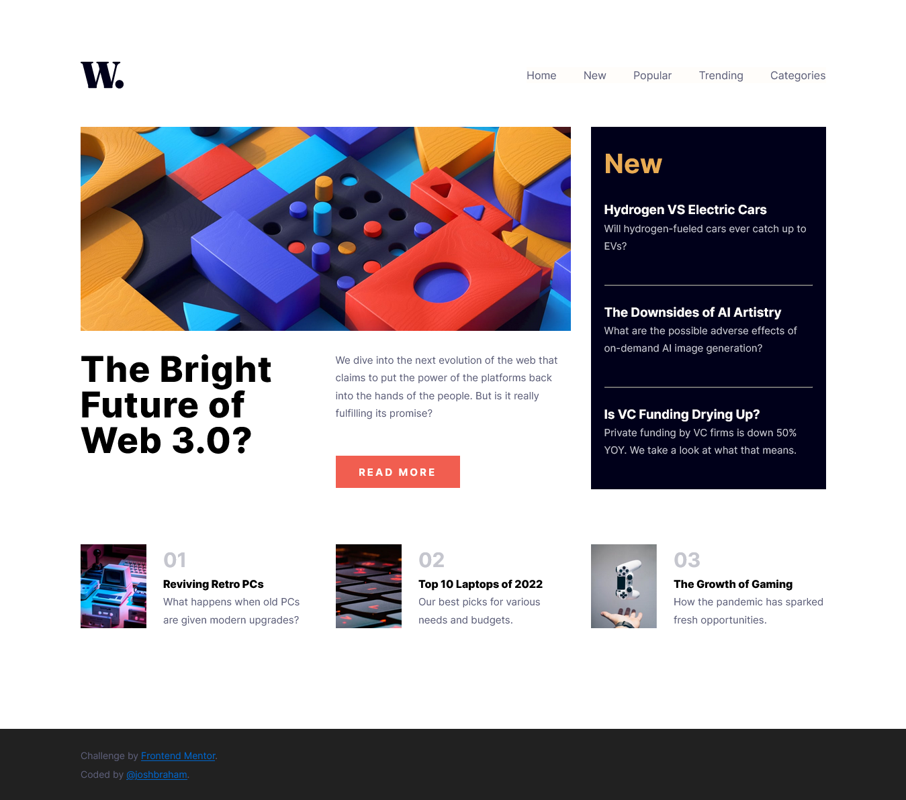

# Frontend Mentor - News homepage solution

This is a solution to the [News homepage challenge on Frontend Mentor](https://www.frontendmentor.io/challenges/news-homepage-H6SWTa1MFl).

### **[Hosted with Netlify](https://jbhm-news-homepage.netlify.app/)** (Click to see in-browser solution)

---

## Overview

### The challenge

Users should be able to:

- View the optimal layout for the interface depending on their device's screen size
- See hover and focus states for all interactive elements on the page

---

### Screenshot

## My process

### Built with

- Semantic HTML5 markup
- CSS custom properties
- Flexbox
- CSS Grid
- JavaScript

---

## Author

- Frontend Mentor - [@joshbraham](https://www.frontendmentor.io/profile/joshbraham)
